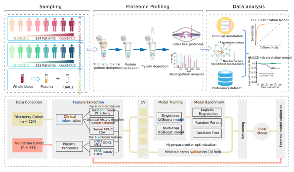

## Plasma Proteomics Analysis of Chronic Coronary Total Occlusion (CTO)

This repository accompanies the manuscript "**Plasma Proteomics Analysis of Chronic Coronary Total Occlusion (CTO).**" It includes all the scripts used for data analysis, figure generation, and computations presented in the manuscript. The research workflow and study design are summarized in the figure above.

### Dependencies

Data analysis was performed using Mac platform in Python (version 3.8.6) and R (version 4.1.0) with open-source libraries. The detail library dependencies are not listed here, they should be resolved automatically when you install the dependencies we mentioned in specific analysis scripts.

### Folders Structure

The files are organised into five folders:

- ***data***: which contains all the plasma proteomics and clinical patient informations required to perform the analyses described in the study. The data files is currently deposited to the zenodo repository and can be available click on [**CTO_Supplementary_data**](https://zenodo.org/).
- ***R***: which contains R scripts for reproducing all analyses and generating the figures presented in the manuscript.
- ***python***: which contains the code mainly used for data preprocessing and models construction, and also including a few figures generation. 
- ***shell***: which contains the shell scripts for library searching.
- ***resources***: which contains additional public databases (eg: DrugTarget and HPA dataset.) which are required by the R and python scripts.

This repository is designed to accompany a manuscript "Plasma proteomic profiling reveals distinct molecular signatures associated with coronary collateral circulation in CTO patients." It includes all the analysis and libraries to recapitulate the figures and computations in this manuscript.